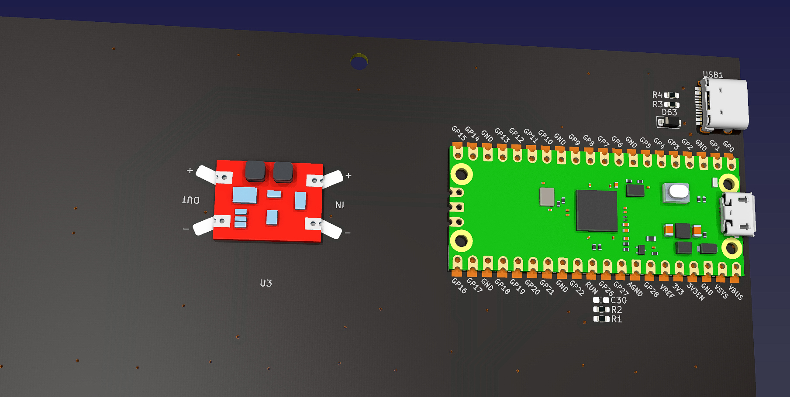
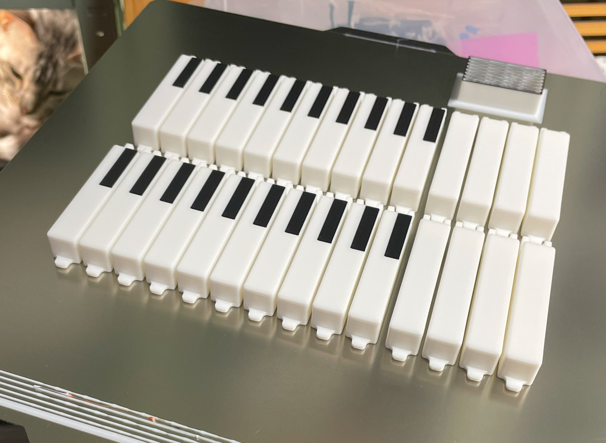
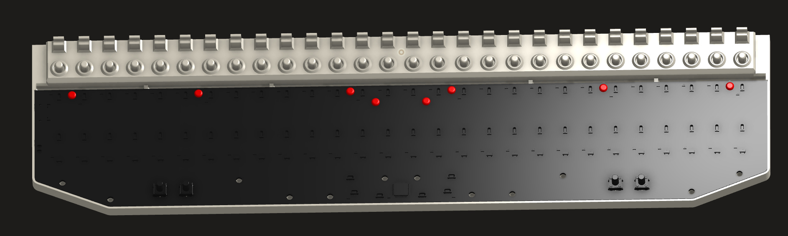
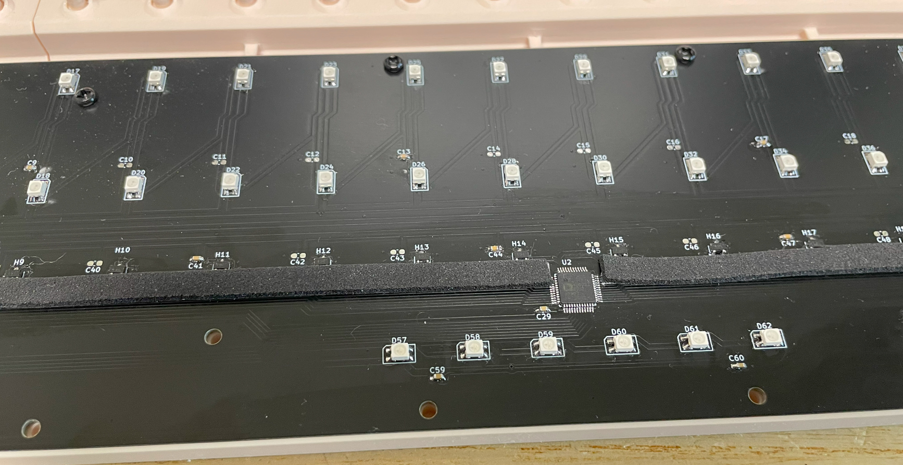
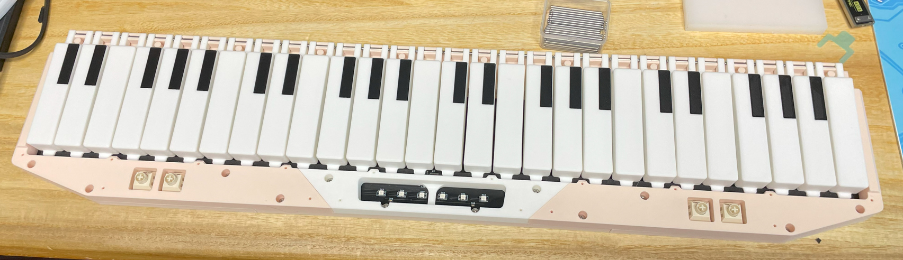
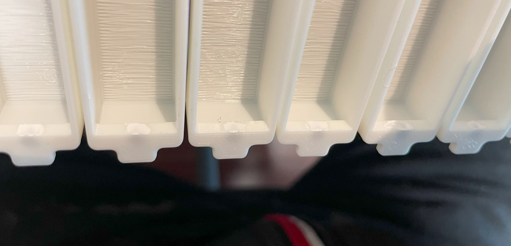
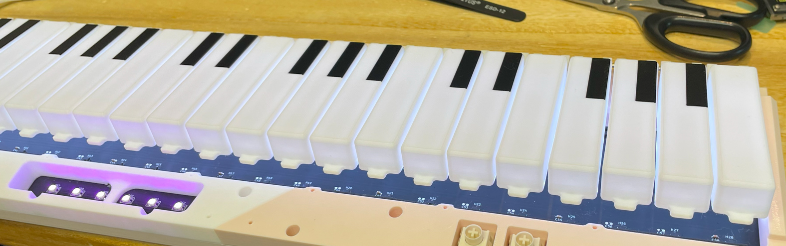
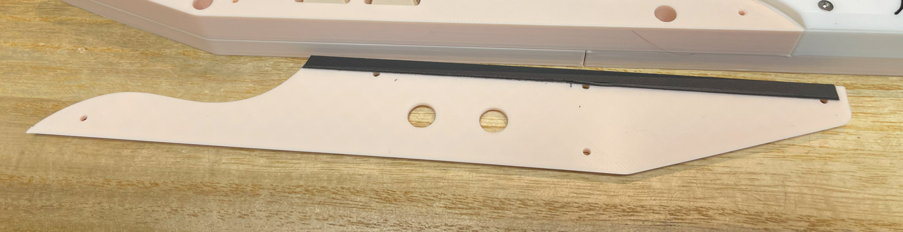

# Nos Pico - Nostalgia Style Mini Controller
[点这里可以切换到中文版](README_CN.md)

Currently there're two sizes of Nos Pico. Nos Pico is the small one, suitable for 15 to 17 inch monitors. Nos Pico+ is the larger one, suitable for 24 to 27 inch monitors. There're no differences except the size.

Features:
* All 3D printed parts.
* Velocity sensitive.
* RGB key lights.
* Works as MIDI keyboard.
* HID lights.
* 4 extra programmable buttons.

Thanks to many respectful guys/companies who made their tools or materials free or open source (KiCad, OnShape, InkScape, Raspberry things).

Special thanks to community projects and developers.
And also these projects:
* RP_Silicon_KiCad: https://github.com/HeadBoffin/RP_Silicon_KiCad
* Type-C: https://github.com/ai03-2725/Type-C.pretty

## About the License
It's CC-NC. So DIY for yourself and for your friend for free, don't make money from it. And plagiarism that doesn’t even dare to mention the original author is not acceptable. Plase note that pooling orders and group buying for raw materials is acceptable. Selling off any leftover components without profit is also acceptable.

If you're interested in buying from me or some kind of commercial use, please contact me (Discord, QQ group, Wechat group or leave your contact in issue section).

## My Discord Invitation
https://discord.gg/M8f2PPQFEA

## My Other Projects
You can check out my other cool projects.

             

* Popn Pico: https://github.com/whowechina/popn_pico
* IIDX Pico: https://github.com/whowechina/iidx_pico
* IIDX Teeny: https://github.com/whowechina/iidx_teeny
* Chu Pico: https://github.com/whowechina/chu_pico
* Mai Pico: https://github.com/whowechina/mai_pico
* Diva Pico: https://github.com/whowechina/diva_pico
* AIC Pico: https://github.com/whowechina/aic_pico
* Groove Pico: https://github.com/whowechina/groove_pico
* Geki Pico: https://github.com/whowechina/geki_pico
* Musec Pico: https://github.com/whowechina/musec_pico
* Ju Pico: https://github.com/whowechina/ju_pico
* Bishi Pico: https://github.com/whowechina/bishi_pico
* Nos Pico: https://github.com/whowechina/nos_pico

## **Disclaimer** ##
I made this project in my personal time without any sponsorship. I will continue to improve the project. I have done my best to ensure that everything is accurate and functional, there's always a chance that mistakes may occur. I cannot be held responsible for any loss of your time or money that may result from using this open source project. Thank you for your understanding.

## HOW TO BUILD
### PCB and Components
* Go JLCPCB or any PCB vendor you like, make order with the gerber zip files (latest `Production\PCB\nos_pico_xxx.zip` for Nos Pico, or `Production\PCB\nos_plus_xxx.zip` for Nos Pico+), regular FR-4 board, black color, **1.6mm** thickness.

* 1x Rasberry Pico Pi Pico or pin-to-pin compatible clones, those with type-C port are strongly recommended.  
  https://www.raspberrypi.com/products/raspberry-pi-pico
* 1x USB Type-C socket (918-418K2023S40001 or KH-TYPE-C-16P)

* 1x ADG732BSUZ (TQFP48) analog multiplexer.  
  https://www.analog.com/en/products/adg732.html
* 1x MBR120VLSFT1G Schottky diode (SOD-123), or any SOD-123 **Schottky** diode with 1A or more current rating.
* 20x to 30x 0603 0.1uF (0.1~1uF all fine) capacitors.
* 3x 0603 5.1kohm resistors, 2 for USB and 1 for signal divider.
* 1x 0603 2kohm resistor for signal divider.
* 28x SS49E linear Hall effect sensors (SOT23).
* 1x Small 3V to 5V DC-DC step up or up-down converter. Make sure its output is 5V and input range covers 3.3V. If the one you get has different pinout, you need to hand wire it.  
  https://www.dfrobot.com/product-1766.html

* for Nos Pico only:
  * 56x WS2812B-4020 RGB LEDs (side facing)
  * 6x WS2812B-3528 RGB LEDs.
  * 4x HDK KSMC614A or Alps SKRGASD010 switches (6mm\*6mm\*9.5mm).  
    https://www.hdk.co.jp/pdf/spj/spj_ksmc614a.pdf  
    https://www.mouser.com/datasheet/2/15/alps_s_a0002902192_1-2258679.pdf
    
* for Nos Pico+ only:
  * 62x WS2812B-3528 RGB LEDs.
  * 4x Kailh Box Cream Pro switches.  
    https://www.kailh.net/products/kailh-box-cream-pro-switch-set

* This is how Nos Pico looks after soldering.  
    
  

* This is how Nos Pico+ looks after soldering.  
    
  

### Notes
1. About the 2 USB holes, you decide whether to solder them or not.   
   

   * If you solder these 2 hole pins.
     * Pros: ether USB ports can be used for host communication; if your pico has a micro USB port, now you'll have a Type-C port and a micro USB port.
     * Cons: if one port is for host communication, the other port can use for power supply, but only from power bank or charger, not from a USB data port.

   * Or you don't solder them (and also better use thin tape to cover the pins on Pi Pico).
     * Pros: only the port from Pi Pico can be used for host communication, the other port can only be used for power supply.
     * Cons: the power supply port can connect to any USB port, inluding USB data ports, power banks or chargers.

2. There're so many capacitors for de-coupling. You don't need to solder them all. You can solder some of them, just distribute them evenly. The one near the multiplexer is a must.

3. Leave C30 un-soldered.

### Test the PCB
* You can test the PCB now, put the firmware in.
* Very likely all key LEDs will light up in white.
* Logo LEDs will slowly change color.
* Nos Pico should be recognized as a USB HID device, here's the test page.  
  https://greggman.github.io/html5-gamepad-test/
* The test page responds to the 4 button switches.
* Use the terminal tool to connect to Nos Pico's command line interface.
  https://googlechromelabs.github.io/serial-terminal/
* Keep the PCB away from magnetic field, such as speakers or motors and execute `calibrate origin`. All values should be similar and near 2200.
* If you notice strange values, you need to check the soldering of the muxiplexer and corresponding hall effect sensor.

### 3D Printing
#### Printing parameters  
* PLA or PETG.
* Layer height: 0.2mm
* Wall: 2 to 3.
* Support: No, unless explicitly mentioned.
* Files are always in milimeter unit, not inch.

#### Parts
* All files are in `Production\3DPrint` folder.
* File names started with `Nos Pico -` are for Nos Pico, and `Nos Pico+ -` are for Nos Pico+.

* Keys: `Key.3mf`. Print 28 keys, 8 all-white, and 20 white-with-black tops (with "black key"). You need multi-color printing for the keys, or you need to manually paint the black part.  
  
* Base: `Base_*.stl`, all in light apricot color.
* Rear: `Rear_*.stl`, all in light apricot color. Make the side with the screws as the bottom and **enable support**.
* Support: `Support_*.stl`, Left and Right are in light apricot color and Center is in white color.
* Panel: `Panel_*.stl`, Left and Right are in light apricot color. The Center is in white color with the black logo on top. You can use multi-color to print it or paint it manually.

### Assembly
#### Other components needed
Please note that the quantities of the screws are approximate.

* 10x M3\*6mm screws for the PCB to the base parts.
* 20x M3\*8mm screws for support parts to the base parts.
* 16x M3\*8mm screws for rear parts to the base parts.
* 20x M2\*8mm countersunk screws for the panels to the support parts.
* Some 2.5mm~3mm thick self-adhesive foam tape (Poron or EVA).
* Some 1mm~1.5mm thick self-adhesive foam tape (Poron or EVA).

* 28x 0.4\*5\*10\*6N (0.4mm wire diameter, 5mm outer diameter, 10mm free length, 6 turns) springs.
* Some white silicone adhesive, such as K-704 silicone industrial adhesive.

* Some 10mm diameter silicone self-adhesive anti-slip pads.  

* For Nos Pico only.
  * 7x 2mm\*50mm steel shafts. (alternatively 14x 2mm\*25mm).
  * 28x 2mm\*2mm axial magnetized cylinder magnets (2mm diameter, 2mm height).

* For Nos Pico+ only.
  * 14x 2mm\*40mm steel shafts. (alternatively 7x 2mm\*80mm).
  * 28x 3mm\*2mm axial magnetized cylinder magnets (3mm diameter, 2mm height).

#### Steps
Please note that the pictures in this section are mixed with Nos Pico and Nos Pico+, some are even from prototype. But the assembly steps are the same. So ignore the differences in some details.

1. Use the M3\*6mm screws to fix the PCB to the base part.  
   
2. Apply the 2.5mm thick foam tape on PCB, right below the hall effect sensors. It damps the key press noise. 3mm width is recommended for Nos Pico, and 5mm width is recommended for Nos Pico+.  
   
3. Use the M3*8mm screws to fix the support parts to the base part.  
   
4. Insert the steel shafts into keys and install them into the base parts. Please note the key arrangements.  
     
   
5. Rotate the keys to the other side to insert the magnets into the keys. Cylinder magnets should be placed vertically. You need some glue or silicone adhesive to fix them in place.
     
     
   
6. Install the springs on the base parts, and rotate the keys onto them.
     
   
7. Now we temporarily calibrate and test the keys use `calibrate travel` command. Leave the keys un-pressed before executing the command, 1 second later, gently press down all the keys (not neccessarily all of them simultanously, just to cover them all). After calibration, keys are ready for play. You can use some MIDI software to test the keys. If all keys work fine, you can proceed to the next step. If not, you need to check the soldering of the hall effect sensors and the multiplexer.  
   
8. Apply the 1mm thick foam tape on the edge of the panel parts. It damps the key release noise.  
   
9.  Use the M2*8mm countersunk screws to fix the panel parts to the support parts.  
    
10. Use the M3*10mm screws to fix the rear parts to the base parts.  
    
11. Now calibrate the key travel again use `calibrate travel` command, don't forget to gently press down all the keys 1 second after executing the command.
12. Apply the silicone self-adhesive anti-slip pads on the bottom of the base parts.  
    
13. Congratulations, you finished!
    

#### Caution
* Don't use `calibrate origin` command after the assembly. It can only be used when there's no magnets installed.
* Screws are easy to break 3D printed parts. So don't screw them too fast or too tight. When you notice the resistance suddenly increases, stop immediately.

### Firmware
* UF2 file is in `Production\Firmware` folder.
* For the new build, hold the BOOTSEL button while connect the USB to a PC, there will be a disk named "RPI-RP2" showed up. Drag the UF2 firmware binary file into it. That's it. Note that there's a small hole on the bottom side of the Nos Pico, aligned with the BOOTSEL button.
* If it's already running Nos Pico firmware, you can either use "update" in command line or hold down left 2 buttons while connecting to USB to enter update mode.
* To access the command line, you can use this Web Serial Terminal to connect to the command line port of the controller. (Note: "?" is for help)  
  https://googlechromelabs.github.io/serial-terminal/

### Usage
* By default, it works as a MIDI keyboard. Just plug and play.
* You can change the report to HID buttons, or HID analog values (axis) with `hid *` command.
* You can change the key light mode using `light *` command.
* You can change the light brightness using `level <key|logo>` command.

## CAD Source File
I'm using OnShape free subscription. It's powerful but it can't archive original designs to local, so I can only share the link here. STL/DXF/DWG files are exported from this online document.  
  https://cad.onshape.com/documents/0429d4b0d9d82f8289fdce7e/w/647e985c461e79dd4ff63d99/e/9dea2fe40b32c7a64632a585
