# Nos Pico - Nostalgia 风格的迷你控制器
[Click here for the English version of this guide.](README.md)

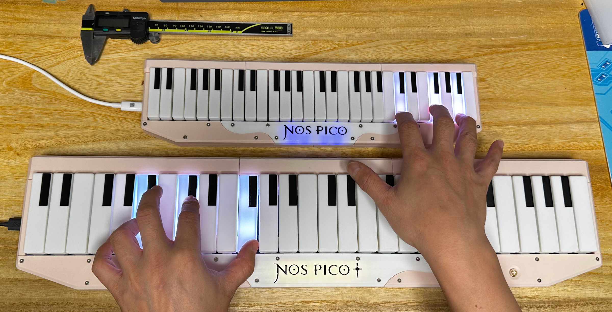

当前有两款 Nos Pico：Nos Pico 是迷你款型，非常小，适合 15 到 17 英寸的显示器，Nos Pico+ 是较大款型，适合 24 到 27 英寸的显示器。两个之间除了大小外没有其他区别。

特性：
* 全 3D 打印的部件。
* 按键力度感应。
* RGB 按键灯光。
* 可作为 MIDI 键盘工作。
* HID 灯光。
* 4 个额外的可编程按钮。

感谢许多尊敬的爱好者和公司将他们的工具或材料免费或开源（KiCad，OnShape，InkScape，Raspberry 相关工具, 嘉立创，等）。

特别感谢社区项目和开发者的帮助，还有如下项目：
* RP_Silicon_KiCad: https://github.com/HeadBoffin/RP_Silicon_KiCad
* Type-C: https://github.com/ai03-2725/Type-C.pretty

## 关于许可证
它是 CC-NC 授权。所以你只能给自己和或者免费给你的朋友 DIY，不能利用这个项目赚钱，比如收费的代做，出售整机等，连源作者都不敢提的抄袭或者稍微改改换个名字来打擦边球就更不可以了。注意团购和拼单订购原始元器件是合理的，非盈利的方式卖掉剩余的元器件也是可以接受的。

如果希望找我购买成品或者寻求商用授权，请联系我（Discord，QQ 群，闲鱼，微信群或者在 issue 区留下你的联系方式）。

## 我的 Discord 服务器邀请
https://discord.gg/M8f2PPQFEA

## 其他项目
你也可以查看我其他的酷炫项目。

             

* Popn Pico: https://github.com/whowechina/popn_pico
* IIDX Pico: https://github.com/whowechina/iidx_pico
* IIDX Teeny: https://github.com/whowechina/iidx_teeny
* Chu Pico: https://github.com/whowechina/chu_pico
* Mai Pico: https://github.com/whowechina/mai_pico
* Diva Pico: https://github.com/whowechina/diva_pico
* AIC Pico: https://github.com/whowechina/aic_pico
* Groove Pico: https://github.com/whowechina/groove_pico
* Geki Pico: https://github.com/whowechina/geki_pico
* Musec Pico: https://github.com/whowechina/musec_pico
* Ju Pico: https://github.com/whowechina/ju_pico
* Bishi Pico: https://github.com/whowechina/bishi_pico
* Nos Pico: https://github.com/whowechina/nos_pico

## **声明** ##
我在个人业余时间内制作了这个项目，并将继续改进这个项目。我已尽我所能确保所有内容的准确性和功能性，但总有可能出现错误。如果你因使用这个开源项目而造成时间或金钱的损失，我不能负责。感谢你的理解。

### 如何制作
#### PCB 和元件
* 前往 JLCPCB 或你喜欢的任何 PCB 制造商，使用 gerber 压缩文件下单（Nos Pico 的最新文件为 `Production\PCB\nos_pico_xxx.zip`，Nos Pico+ 的为 `Production\PCB\nos_plus_xxx.zip`）。选择常规 FR-4 板材，黑色，**1.6mm** 厚度。

* 1 个 Raspberry Pi Pico 或针脚兼容的克隆板，推荐带 Type-C 接口的版本。  
  https://www.raspberrypi.com/products/raspberry-pi-pico
* 1 个 USB Type-C 插座（型号：918-418K2023S40001 或 KH-TYPE-C-16P）。

* 1 个 ADG732BSUZ (TQFP48) 模拟多路复用器。  
  https://www.analog.com/en/products/adg732.html
* 1 个 MBR120VLSFT1G 肖特基二极管（SOD-123），或任何 1A 或以上电流额定值的 SOD-123 **肖特基**二极管。
* 20 到 30 个 0603 尺寸的 0.1uF 电容（0.1~1uF 均可）。
* 3 个 0603 尺寸的 5.1kΩ 电阻，2 个用于 USB，1 个用于信号分压。
* 1 个 0603 尺寸的 2kΩ 电阻，用于信号分压。
* 28 个 SS49E 线性霍尔效应传感器（SOT23 封装）。
* 1 个小型 3V 到 5V 的 DC-DC 升压或升降压转换器。确保输出为 5V，输入范围覆盖 3.3V。如果你购买的模块引脚定义不同，则需要手动接线。  
  https://www.dfrobot.com/product-1766.html

* 对于 Nos Pico：
  * 56 个 WS2812B-4020 RGB LED（侧发光）。
  * 6 个 WS2812B-3528 RGB LED。
  * 4 个 HDK KSMC614A 或 Alps SKRGASD010 按键开关（6mm\*6mm\*9.5mm）。  
    https://www.hdk.co.jp/pdf/spj/spj_ksmc614a.pdf  
    https://www.mouser.com/datasheet/2/15/alps_s_a0002902192_1-2258679.pdf

* 对于 Nos Pico+：
  * 62 个 WS2812B-3528 RGB LED。
  * 4 个 凯华 Box 冰淇淋 Pro 按键开关。  
    https://www.kailh.net/products/kailh-box-cream-pro-switch-set

* 这是焊接完成后的 Nos Pico：  
  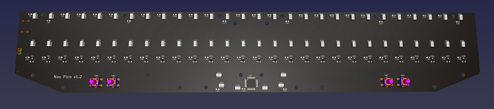  
  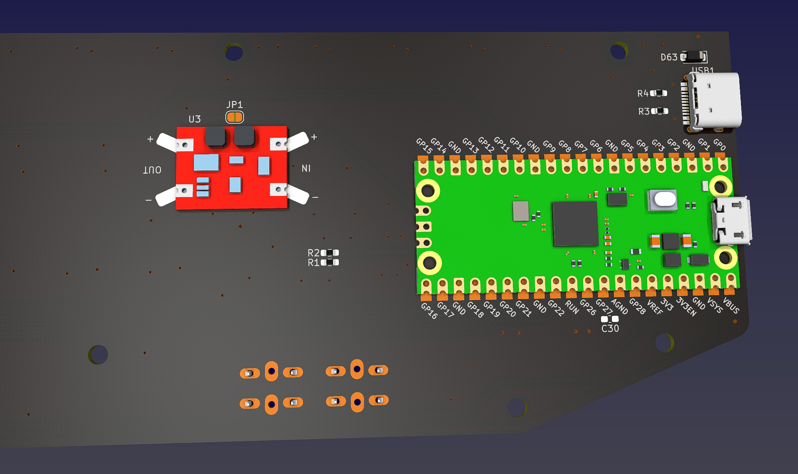

* 这是焊接完成后的 Nos Pico+：  
  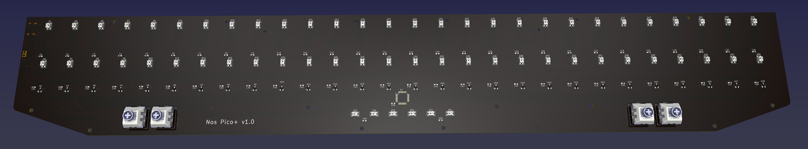  
  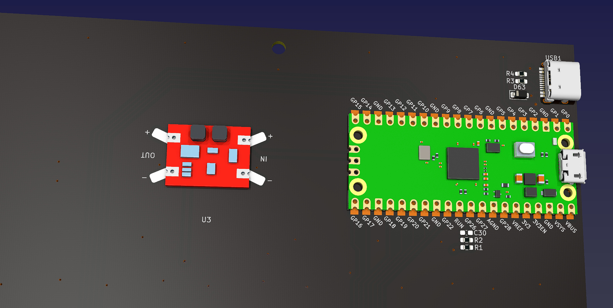

### 注意事项
1. 关于这两个 USB 焊点，你可以选择是否焊接它们。  
   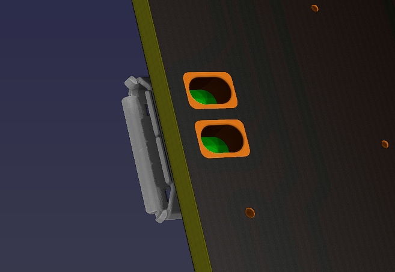

   * 如果你焊接了这两个焊点：
     * 优点：两个 USB 接口都可以用于主机通信；如果你的 Pico 带有 micro USB 接口，现在你将拥有一个 Type-C 接口和一个 micro USB 接口。
     * 缺点：如果一个接口用于主机通信，另一个接口可以用于供电，但仅限于使用移动电源或充电器，不能连接到 USB 数据端口。

   * 如果你不焊接它们（并且最好用薄胶带覆盖 Pi Pico 上的焊点）：
     * 优点：只有来自 Pi Pico 的接口可以用于主机通信，另一个接口只能用于供电。
     * 缺点：供电接口可以连接到任何 USB 端口，包括 USB 数据端口、移动电源或充电器。

2. 去耦电容的数量很多，你不需要全部焊接。可以选择焊接一部分，尽量均匀分布。靠近多路复用器的那颗电容是必须焊接的。

3. 不要焊接 C30 电容。

### 测试 PCB
* 现在你可以测试 PCB 了，先将固件烧录进去。
* 极有可能所有按键的 LED 会亮起白光。
* Logo 的 LED 会慢慢变换颜色。
* Nos Pico 应该会被电脑识别为一个 USB HID 设备，这里是测试页面：  
  https://greggman.github.io/html5-gamepad-test/
* 测试页面会响应 4 个按钮开关的操作。
* 使用终端工具连接到 Nos Pico 的命令行接口：  
  https://googlechromelabs.github.io/serial-terminal/
* 将 PCB 远离磁场（例如扬声器或电机），然后执行 `calibrate origin` 命令。所有的值应该接近 2200 并且值都差不多。
* 如果发现异常值，你需要检查多路复用器和对应霍尔效应传感器的焊接情况。

### 3D 打印
#### 打印参数  
* 材料：PLA 或 PETG。
* 层高：0.2mm
* 壁厚：2 到 3 层。
* 支撑：不需要，除非特别说明。
* 文件单位始终为毫米，而非英寸。

#### 部件
* 所有文件都在 `Production\3DPrint` 文件夹中。
* 文件名以 `Nos Pico -` 开头的是为 Nos Pico 准备的，以 `Nos Pico+ -` 开头的是为 Nos Pico+ 准备的。

* 按键：`Key.3mf`。打印 28 个按键，其中 8 个为全白，20 个为白色底部带黑色顶部（“黑键”）。按键需要多色打印，或者你手工涂黑顶部黑键部分。  
  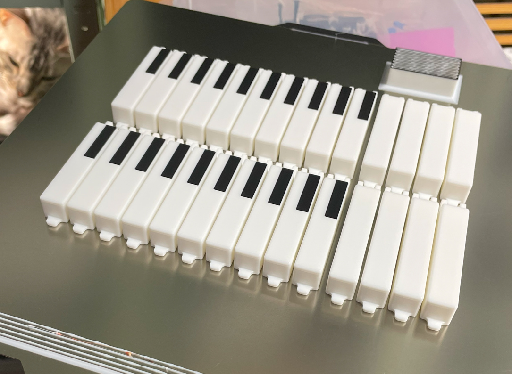
* 底座：`Base_*.stl`，全部为浅杏色。
* 后盖：`Rear_*.stl`，全部为浅杏色。将带有螺丝孔的一面朝下，并**启用支撑**。
* 支撑件：`Support_*.stl`，左右两部分为浅杏色，中间部分为白色。
* 面板：`Panel_*.stl`，左右两部分为浅杏色，中间部分为白色，顶部带有黑色 Logo。你可以使用多色打印，或者手工涂黑 Logo。

### 组装
#### 所需其他组件
请注意，螺丝的数量是大致估算的。

* 10 个 M3\*6mm 螺丝，用于将 PCB 固定到底座部件。
* 20 个 M3\*8mm 螺丝，用于将支撑部件固定到底座部件。
* 16 个 M3\*8mm 螺丝，用于将后盖固定到底座部件。
* 20 个 M2\*8mm 平头螺丝，用于将面板固定到支撑部件。
* 一些 2.5mm~3mm 厚的自粘泡棉胶带（Poron 或 EVA）。
* 一些 1mm~1.5mm 厚的自粘泡棉胶带（Poron 或 EVA）。

* 28 个 0.4\*5\*10\*6N 弹簧（0.4mm 线径，5mm 外径，10mm 自由长度，6 圈）。
* 一些白色硅胶粘合剂，例如 K-704 硅胶工业粘合剂。

* 一些直径为 10mm 的硅胶自粘防滑垫。

* 仅适用于 Nos Pico：
  * 7 根 2mm\*50mm 钢轴（或者 14 根 2mm\*25mm 钢轴）。
  * 28 个 2mm\*2mm 轴向磁化圆柱形磁铁（直径 2mm，高度 2mm）。

* 仅适用于 Nos Pico+：
  * 14 根 2mm\*40mm 钢轴（或者 7 根 2mm\*80mm 钢轴）。
  * 28 个 3mm\*2mm 轴向磁化圆柱形磁铁（直径 3mm，高度 2mm）。

#### 步骤
请注意，本节中的图片混合了 Nos Pico 和 Nos Pico+，有些甚至来自原型。但组装步骤是相同的，因此可以忽略某些细节上的差异。

1. 使用 M3\*6mm 螺丝将 PCB 固定到底座部件上。  
   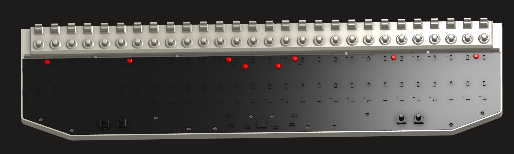
2. 在 PCB 上、霍尔效应传感器下面一点贴上 2.5mm 厚的泡棉胶带，用来减小按键按下时的噪音。建议 Nos Pico 使用 3mm 宽的胶带，Nos Pico+ 使用 5mm 宽的胶带。  
   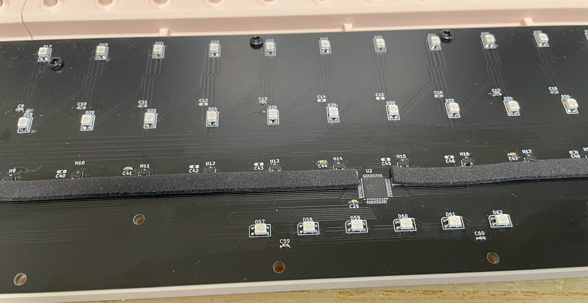
3. 使用 M3\*8mm 螺丝将支撑部件固定到底座部件上。  
   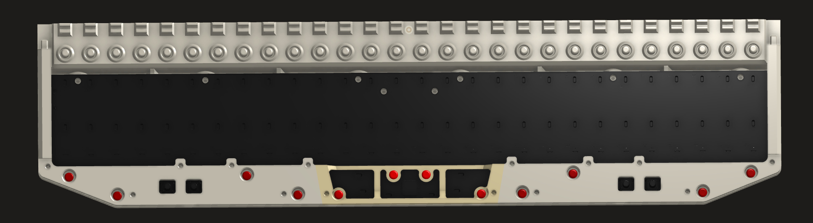
4. 将钢轴插入按键中，并将按键安装到底座部件上。请注意按键的排列方式。  
   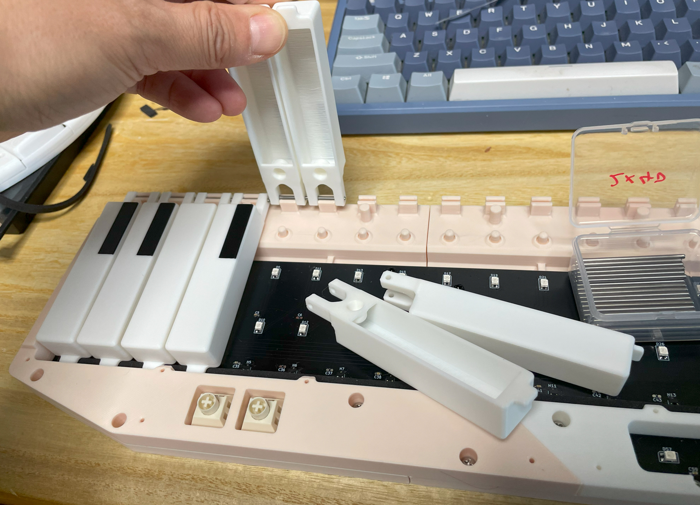  
   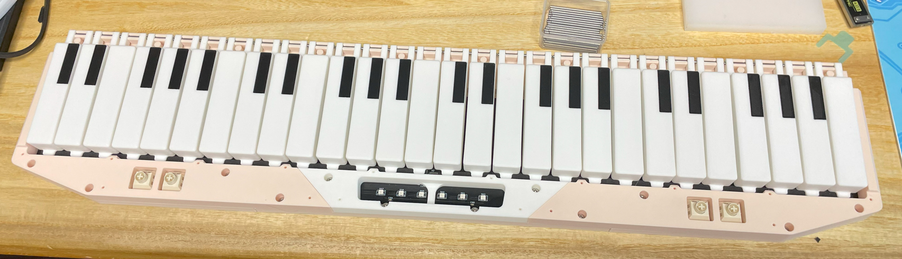
5. 将按键旋转到另一侧，将磁铁嵌入到按键中。圆柱形磁铁应垂直放置。你需要使用一些胶水或硅胶粘合剂将它们固定到位。  
   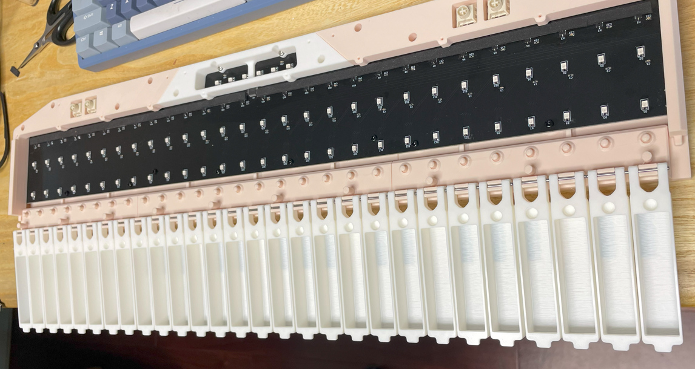  
     
   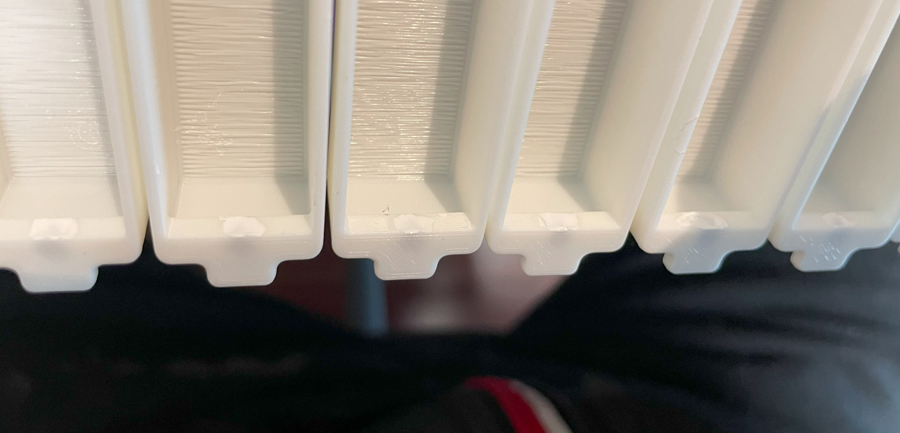
6. 在底座部件上安装弹簧，然后将按键旋转回弹簧上。  
   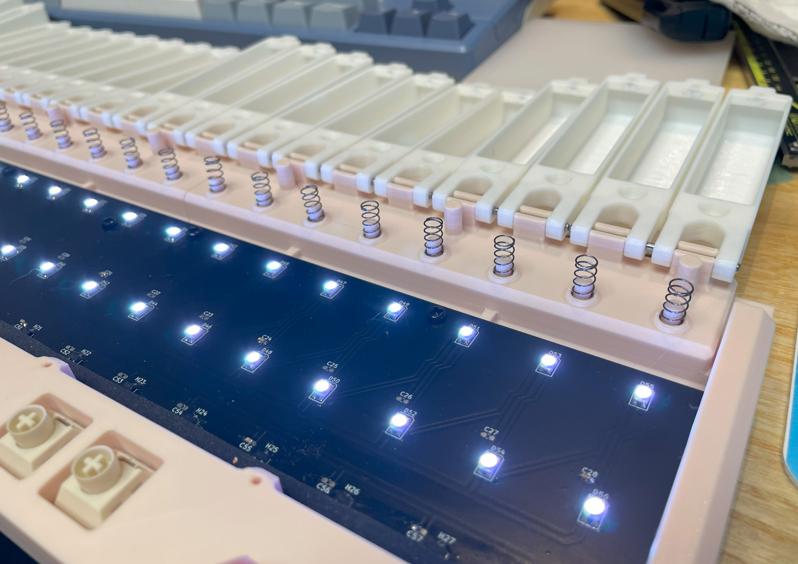  
   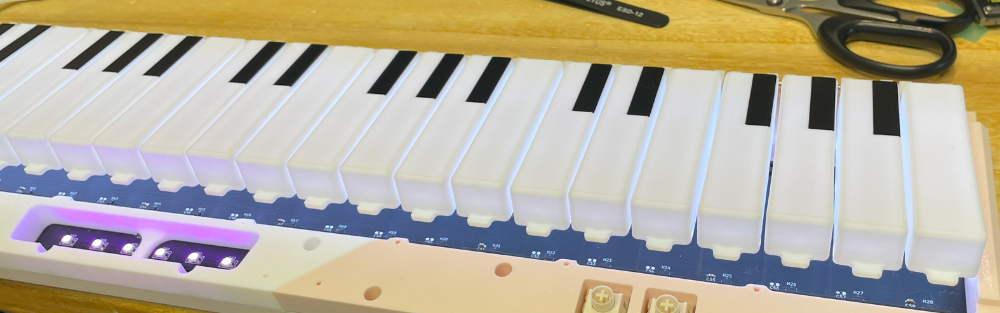
7. 现在需要临时校准并测试按键，这需要 `calibrate travel` 命令。在执行命令前不要按下按键，1 秒后温柔的按下所有按键（不需要同时按下，只需覆盖所有按键即可）。校准完成后，按键即可使用。你可以使用一些 MIDI 软件测试按键。如果所有按键都正常工作，可以继续下一步。如果有问题，你需要检查霍尔效应传感器和多路复用器的焊接情况。  
   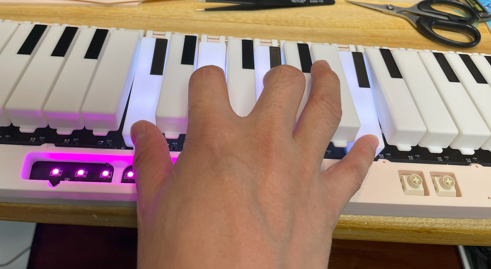
8. 在面板部件的边缘贴上 1mm 厚的泡棉胶带。这可以减小按键松开时的噪音。  
   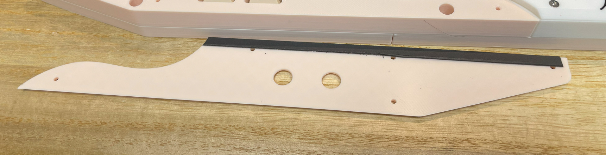
9. 使用 M2\*8mm 平头螺丝将面板部件固定到支撑部件上。  
   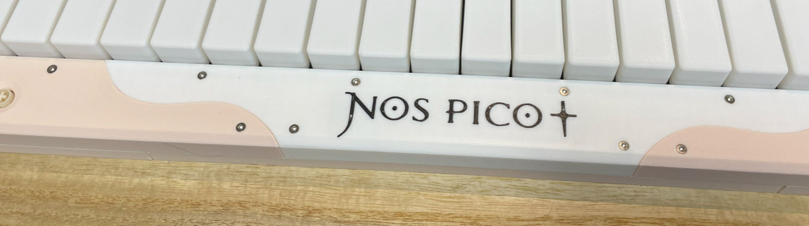
10. 使用 M3\*10mm 螺丝将后盖固定到底座部件上。  
    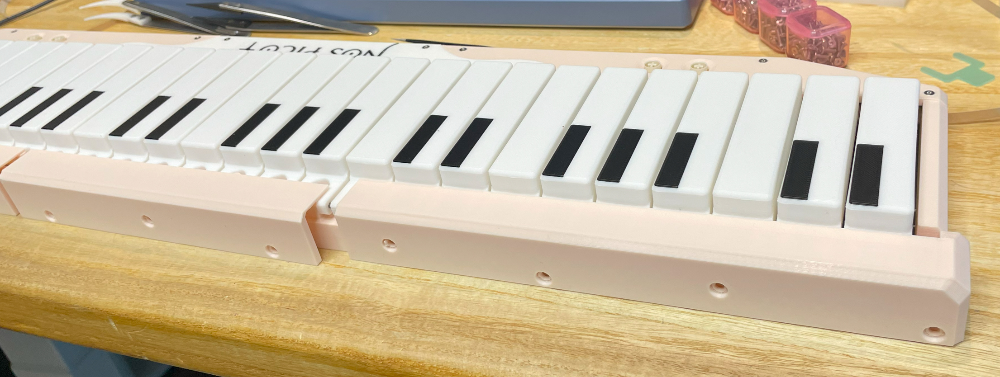
11. 再次使用 `calibrate travel` 命令校准按键行程，不要忘记在执行命令 1 秒后温柔的按下所有按键。
12. 在底座部件的底部贴上硅胶自粘防滑垫。  
    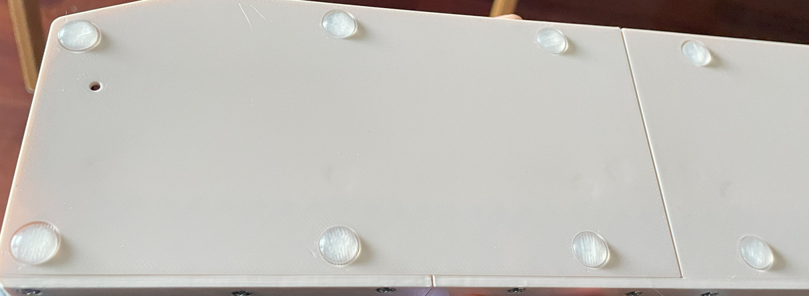
13. 恭喜你，组装完成！  
    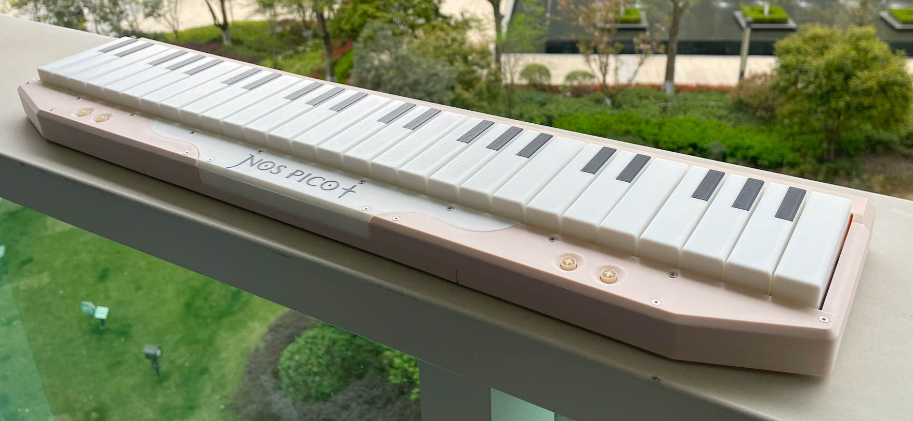

#### 注意事项
* 组装完成后不要使用 `calibrate origin` 命令。该命令只能在未安装磁铁时使用。
* 螺丝很容易损坏 3D 打印的部件，因此不要拧得太快或太紧。当你注意到阻力突然增加时，请立即停止。

### 固件
* UF2 文件位于 `Production\Firmware` 文件夹中。
* 对于新设备，按住 BOOTSEL 按钮的同时将 USB 连接到电脑，会显示一个名为 "RPI-RP2" 的磁盘。将 UF2 固件二进制文件拖入其中即可完成烧录。提醒：Nos Pico 底部有一个小孔，正对着 BOOTSEL 按钮。
* 如果设备已经运行 Nos Pico 固件，你可以通过命令行使用 "update" 命令更新，或者在连接 USB 时按住左侧的两个按钮进入更新模式。
* 要访问命令行接口，可以使用这个 Web Serial Terminal 工具连接到控制器的命令行端口。（注意：输入 "?" 可以查看帮助）  
  https://googlechromelabs.github.io/serial-terminal/

### 使用方法
* 默认情况下，设备作为 MIDI 键盘工作，插上即可使用。
* 你可以使用 `hid *` 命令将报告更改为 HID 按钮或 HID 模拟值（轴）。
* 你可以使用 `light *` 命令更改按键灯光模式。
* 你可以使用 `level <key|logo>` 命令更改灯光亮度。

## CAD 源文件
我使用的是 OnShape 的免费订阅。它很强大，但不能将原始设计存档到本地，所以我只能在这里分享链接。STL/DXF/DWG 文件是从这个在线文档导出的。
  https://cad.onshape.com/documents/0429d4b0d9d82f8289fdce7e/w/647e985c461e79dd4ff63d99/e/9dea2fe40b32c7a64632a585
